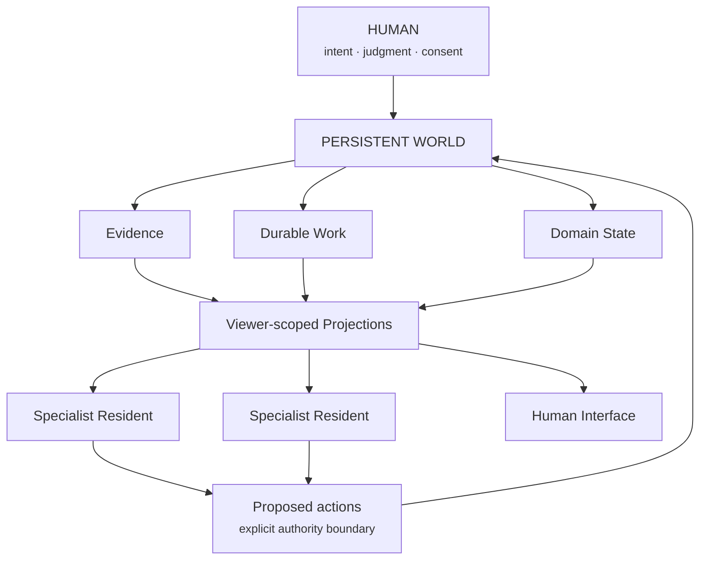

# Wonderful Digital World

Wonderful Digital World (WDW) is a **persistent computational environment** for
a human life. It is not a multi-agent framework, a dashboard, or a character
simulation. Its durable loop is:

`persistent world -> observe -> understand -> reconcile -> act -> learn -> continue`



This repository publishes the portable architecture: vocabulary, invariants,
contracts, synthetic examples, and small executable reference code. It does not
publish a person's lived state, memories, credentials, private prompts, or
production integrations.

> The human provides the human things. The computer handles the computer things.

## What works here

The Python packages implement and test a deliberately small seam through the
architecture:

- immutable evidence with provenance and content digests;
- idempotent, persist-before-routing inbox behavior;
- durable work items with `acted`, `blocked`, and `abstained` outcomes;
- evidence/interpretation/proposed-action separation;
- explicit capability checks for effects;
- versioned, freshness-aware, viewer-authorized projections; and
- one deterministic observe/understand/reconcile iteration.

This is a reference implementation, not a deployable personal world. See
[implementation status](docs/implementation-status.md) before building on it.

## Run it

Requires Python 3.11 or newer and has no runtime dependencies.

```sh
PYTHONPATH=packages python3 -m unittest discover -s tests -v
PYTHONPATH=packages python3 examples/ingress_to_projection.py
```

Start with [architecture](docs/architecture.md), [ontology](docs/ontology.md),
and [invariants](docs/invariants.md). The [persistent-world example](examples/ingress_to_projection.py)
is the shortest executable tour.

## Repository map

- `docs/`: architecture, boundaries, authority, evolution, and status
- `packages/`: small executable contracts, separated by responsibility
- `examples/`: runnable synthetic flows
- `fixtures/`: synthetic data only
- `diagrams/`: source-controlled diagrams
- `residents/`: resident protocol, not private resident implementations
- `tests/`: executable architectural invariants

## Related projects

The Human Model and Bridget are independent projects with narrower concerns.
World View / Tiny Places is also independent: a GPL-licensed visual projection
may consume WDW's projection contract, but it is not this environment and no GPL
code is included here. See [relationships](docs/relationships.md) and
[World View / Tiny Places](docs/world-view-tiny-places.md).

## License

Code and documentation in this repository are available under the [MIT License](LICENSE).
Third-party projects retain their own licenses.
