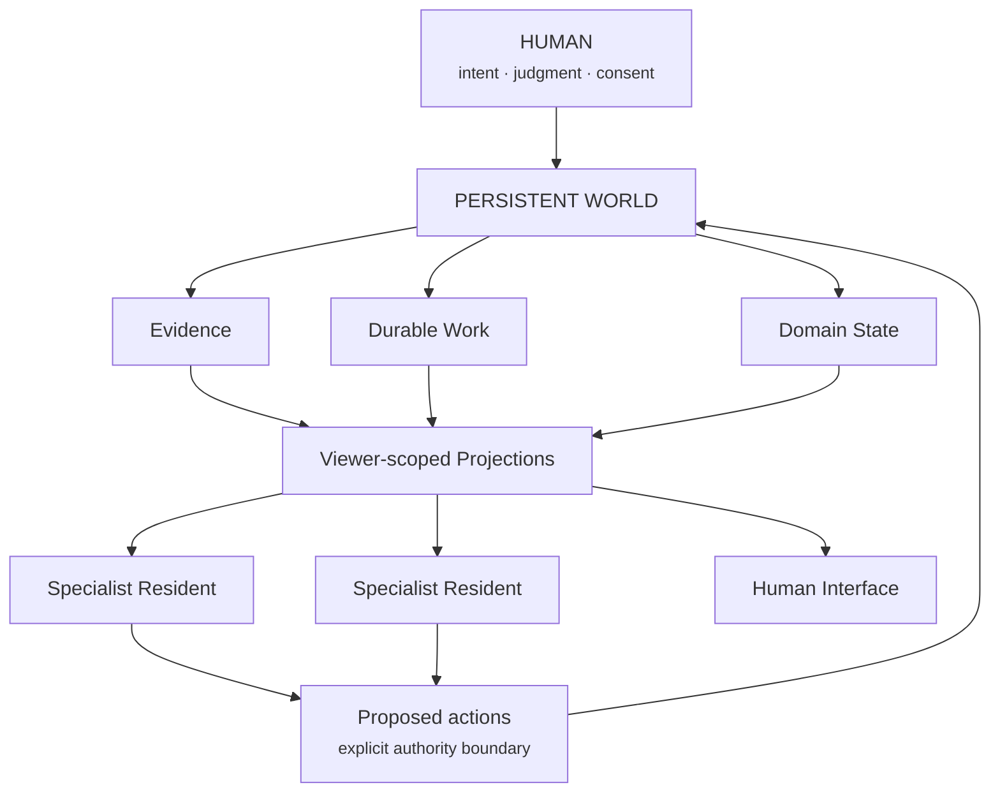

# Wonderful Digital World

Wonderful Digital World (WDW) is a **persistent computational environment** for
a human life. It is not a multi-agent framework, a dashboard, or a character
simulation. Its durable loop is:

`persistent world -> observe -> understand -> reconcile -> act -> learn -> continue`



This repository publishes the portable architecture: vocabulary, invariants,
contracts, synthetic examples, and small executable reference code. It does not
publish a person's lived state, memories, credentials, private prompts, or
production integrations.

> The human provides the human things. The computer handles the computer things.

## Why this exists

Most software still makes the human act as its integration and orchestration
layer. The human has to remember which system owns what, move information
between tools, repeat context the computer has already seen, and reconstruct
decisions already made. They notice failed automation, route obvious work, keep
boards and interfaces synchronized, and learn each tool's internal abstractions
just to express intent.

Adding an LLM or chatbot does not necessarily remove that burden. A
conversational interface can still leave the human responsible for persistent
state, routing, synchronization, retries, permissions, source-of-truth choices,
context reconstruction, and operational monitoring. It may make commands easier
to phrase without changing who operates the control plane.

> **Why is the human still the orchestration layer?**

WDW's response is to move mechanical coordination into persistent software
while preserving human authority where intent, judgment, consent, taste,
ambiguity, or consequences make human involvement valuable. This is a
human-in-the-loop system with explicit authority boundaries and domain
ownership—not a system that uses the human as its runtime integration layer.

## The architectural bet

WDW is organized around four bets.

### The world persists independently of conversation

Conversation is one interface into durable state, not the canonical state
itself. Work, evidence, outcomes, and domain state survive the process, model,
or interface handling them.

### Deterministic software provides structure; AI provides reasoning

Use deterministic mechanisms where guarantees matter: persistence, identity,
idempotency, known-rule routing, permissions, provenance, lifecycle, retries,
budgets and enforcement, and canonical mutation.

Use probabilistic model reasoning where ambiguity earns its cost:
interpretation, synthesis, recommendations, contextual prioritization,
uncertain classification, and judgment.

> **Deterministic where possible; agentic where valuable.**

> **LLMs are components, not the architecture.**

### Domains retain ownership

Bounded contexts own their canonical state. Residents and interfaces may
interpret evidence, propose actions, and produce projections, but they do not
silently become canonical owners of the state they consume.

### Human judgment remains at meaningful boundaries

The goal is not to remove the human from the loop. It is to move the human to
the part of the loop where human contribution matters.

> **Move the human to the right part of the loop.**

Mechanical coordination should disappear into software. Consequential judgment
remains human-controlled.

## Core concepts

The architecture diagram rests on a small vocabulary:

- **Evidence** — source-backed information that retains provenance.
- **Domain state** — canonical state owned by the appropriate domain.
- **WorkItem** — durable work that survives the worker performing it.
- **Resident** — a bounded specialist with its own responsibility and authority.
- **Projection** — a viewer-scoped, non-canonical representation of world state.
- **Proposed action** — a recommendation for change, not permission to mutate
  canonical state.
- **Interface** — a port into the world, not the world itself.

See the [portable ontology](docs/ontology.md) for the formal distinctions.

## Human-centered is a technical constraint

In WDW, human-centered computing is not visual-design branding. It is an
engineering constraint: reduce cognitive load and interaction cost; make
changing one's mind cheap; treat repeated manual work as a systems signal; and
preserve uncertainty instead of inventing facts. Observability should match
useful human mental models without exposing the entire human model.

That leads to minimum-sufficient-context projections, least-privilege authority,
clear provenance, and interfaces that can be replaced without replacing the
world beneath them. HCI concerns therefore shape abstraction boundaries,
contextual projections, and control-plane design.

> **A feature should reduce operation, not relocate it.**

> **The interface is disposable; the model persists.**

## Architecture evolution

WDW was not designed fully formed. It evolved through experiments in human
modeling, continuity, QA automation, self-healing systems, and observability.
The [architecture history](docs/evolution.md) records which ideas were promoted,
rejected, narrowed, or superseded as those boundaries were learned through
implementation.

## What works here

The Python packages implement and test a deliberately small seam through the
architecture:

- immutable evidence with provenance and content digests;
- idempotent, persist-before-routing inbox behavior;
- durable work items with `acted`, `blocked`, and `abstained` outcomes;
- evidence/interpretation/proposed-action separation;
- explicit capability checks for effects;
- versioned, freshness-aware, viewer-authorized projections; and
- one deterministic observe/understand/reconcile iteration.

This is a reference implementation, not a deployable personal world. See
[implementation status](docs/implementation-status.md) before building on it.

## Run it

Requires Python 3.11 or newer and has no runtime dependencies.

```sh
PYTHONPATH=packages python3 -m unittest discover -s tests -v
PYTHONPATH=packages python3 examples/ingress_to_projection.py
```

Start with [architecture](docs/architecture.md), [ontology](docs/ontology.md),
and [invariants](docs/invariants.md). The [persistent-world example](examples/ingress_to_projection.py)
is the shortest executable tour.

## Repository map

- `docs/`: architecture, boundaries, authority, evolution, and status
- `packages/`: small executable contracts, separated by responsibility
- `examples/`: runnable synthetic flows
- `fixtures/`: synthetic data only
- `diagrams/`: source-controlled diagrams
- `residents/`: resident protocol, not private resident implementations
- `tests/`: executable architectural invariants

## Related projects

These projects are independently implemented and are not WDW packages:

- **The Human Model** explores longitudinal representation of a changing person:
  evidence, uncertainty, interventions, outcomes, and canonical human-domain
  state.
- **Bridget** explores persistent continuity and reconciliation through a bounded
  resident rather than a universal assistant or gateway.
- **QA Agents** contributed patterns for durable shared state, stable issue
  fingerprints, advisory routing, and explicit outcomes without becoming part of
  WDW.
- **[World View / Tiny Places](https://github.com/Wonderful-Digital-World/world-view)**
  explores visual projection and observability over the persistent world while
  remaining independently implemented and GPL-separated.

See [relationships](docs/relationships.md) and the detailed
[World View / Tiny Places boundary](docs/world-view-tiny-places.md).

## License

Code and documentation in this repository are available under the [MIT License](LICENSE).
Third-party projects retain their own licenses.
