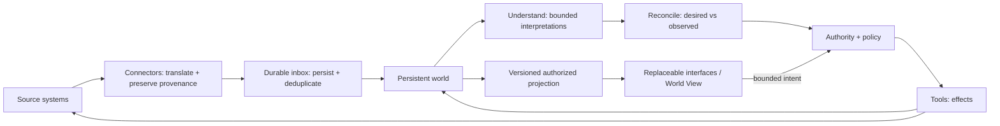

# System diagram

The diagram shows responsibility and data boundaries, not mandatory deployment
services. Any agentic component belongs inside a bounded understanding or
proposal step; it does not bypass persistence or authority.
